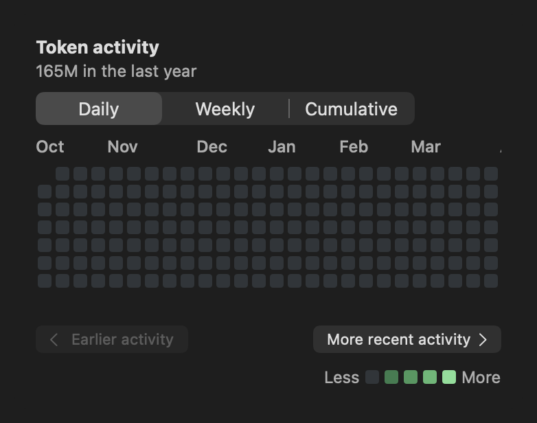
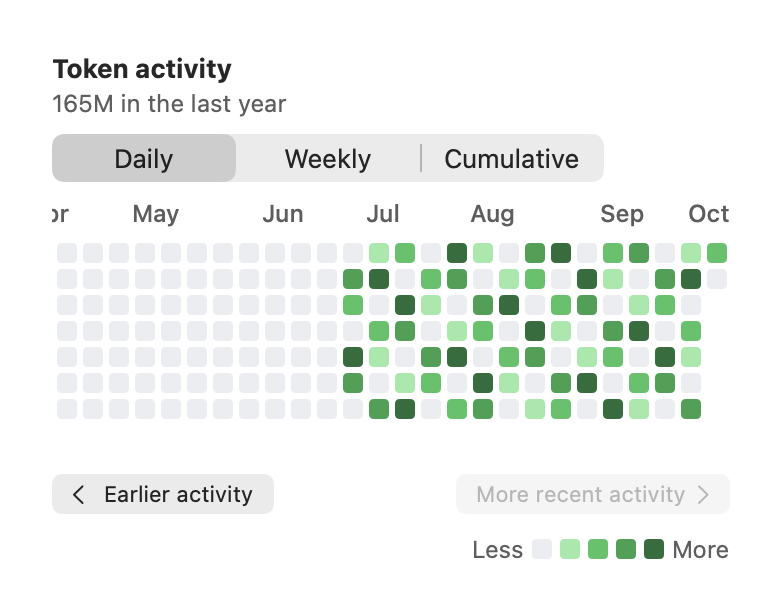
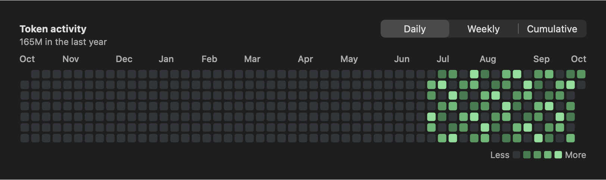

# Token activity readability

These are native SwiftUI component renders using fixed synthetic activity and a fixed date. The displayed total is a test fixture; no personal usage, account history, or original user screenshot is included. The images cover the component, not an installed full-app session.

At 339 points of content width, the previous layout squeezed the entire year into tiny cells and let the English title wrap into a narrow column. The updated layout keeps days at least 10 points wide, defaults to the recent end, and provides labeled navigation with overlapping weeks. At 760 points, the year fits and the navigation row disappears.

## Before: narrow Dark mode

Rendered with the same synthetic input against the unmodified base implementation.


## After: narrow Dark mode, recent end


## After: narrow Dark mode, earliest end



## After: narrow Light mode



## After: wide Dark mode



## Native proof

To enable the optional native rendering, mouse-click, and date-reveal tests from the repository root on macOS:

```bash
source Scripts/test_environment.sh
CODEXBAR_ACTIVITY_READABILITY_PROOF_DIR="$PWD/.build/activity-proof" \
  swift test --filter 'SpendActivityAppearanceTests|SpendActivityHeatmapTests|SpendActivityReadabilityRenderTests|LocalizationLanguageCatalogTests|LocalizationBundleTests|UserFacingLocalizationCoverageTests'
```

The final focused run passed 85 Swift Testing tests and all 3 enabled native XCTest cases. The screenshot matrix produced 80 images across Chinese/English, Light/Dark mode, 339/520/760-point widths, all three activity modes, partial coverage, and zero activity. Native mouse events changed the 339-point viewport offsets through `350, 26, 0, 0, 325, 350, 350`: both ends are reachable, and clicking the disabled end controls does not move the viewport.

`make check` passed. The final activity/localization groups (87, 119, and 137 of 143) also passed through the repository's `make test` entrypoint. The final navigation version did not receive another complete repository regression run. The preceding scrolling version passed 142/143 groups; the unmodified menu-bar cached-title performance budget failed, and its cause was not established. This is not a full-suite pass claim. Installed-app trackpad and VoiceOver operation remain unverified.
